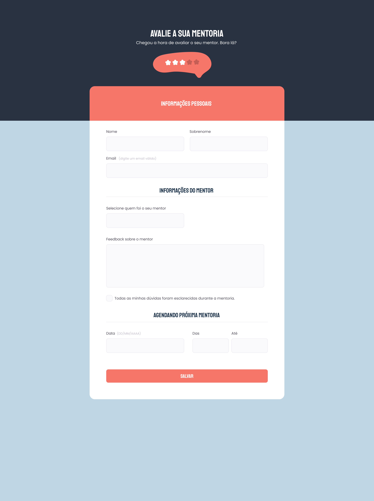

# explorer-bonus-challenge-4

## Project Overview

Welcome to the `explorer-bonus-challenge-4`! This project is a challenge aimed at mastering and demonstrating expertise in HTML and CSS. It's designed to replicate a design from Figma, emphasizing practical skills in front-end development.

## Design Reference

The layout and design of this project are based on the following Figma project: [Figma Project](https://www.figma.com/file/fnZyJHs7eqNFAA7tUrKcsD/Stage-03---Formul%C3%A1rio-avan%C3%A7ado/duplicate). This link will guide you to the original design, serving as a blueprint for our implementation.

## Project Preview

Below is a preview of the project:



_Note: The image is located in the `project` folder under the name `project.png`._

## Project Structure

The project is structured with simplicity and functionality in mind. It comprises two main files:

- `index.html`: This file contains the HTML structure of the project.
- `style.css`: This file includes all the CSS required to style the HTML content, adhering to the design specified in the Figma project.

## Cloning the Project

To clone this project for local development, follow these steps:

1. Open your terminal.
2. Clone the repository using the following command:

   ```
   git clone https://github.com/giovannivicentin/explorer-bonus-challenge-4
   ```

3. Navigate to the project directory:

   ```
   cd explorer-bonus-challenge-4
   ```

4. You can now open the project in your preferred code editor to view, edit, and run it locally.
